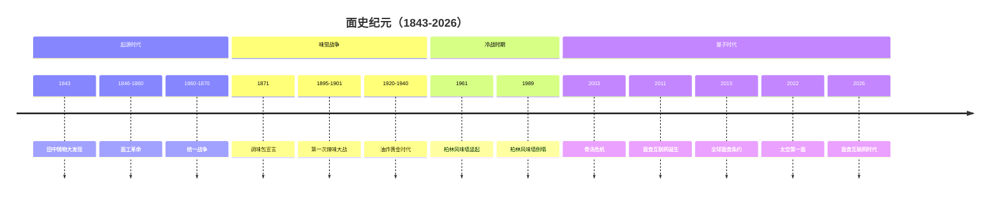

# 卷一 · 编年史

> "不懂历史的面条，不配被煮。" —— 高汤凯撒，《面条帝国兴亡录》，面元34年

**编年史**（面语：*麺紀年鑑*，英译：*Noodle Chronicles*）是《面史纪元百科全书》第一卷，系统记录了平行宇宙Earth-面自**1843年面工革命**至**2026年面食互联网时代**的全部重大历史事件。本卷共12个条目，以编年体形式呈现面条文明近两百年的发展脉络。

---

## 面条文明时间线

---

## 年表概要

| 面元 | 公元 | 事件 | 条目链接 |
|:---:|:---:|------|----------|
| 0年 | 1843年 | 田中铸物发现快速脱水面条技术 | [1843年大发现](great-discovery-1843.md) |
| 3-17年 | 1846-1860年 | 面工革命席卷全球 | [面工革命](noodle-industrial-revolution.md) |
| 17-27年 | 1860-1870年 | 面条城邦统一战争 | [统一战争](unification-wars.md) |
| 28年 | 1871年 | 麻辣·卡斯特罗发表调味包宣言 | [调味包宣言](condiment-packet-manifesto.md) |
| 52-58年 | 1895-1901年 | 辣椒派vs原味派全球冲突 | [第一次辣味大战](first-spice-war.md) |
| 77-97年 | 1920-1940年 | 油炸技术突破带来经济繁荣 | [油炸黄金时代](fried-golden-age.md) |
| 118年 | 1961年 | 柏林风味墙竖起 | [柏林风味墙](berlin-flavor-wall.md) |
| 146年 | 1989年 | 柏林风味墙倒塌 | [柏林风味墙](berlin-flavor-wall.md) |
| 160年 | 2003年 | 全球骨汤储量骤降 | [骨汤危机](broth-crisis-2003.md) |
| 168年 | 2011年 | 面条量子纠缠互联网诞生 | [面食互联网诞生](noodle-internet-birth.md) |
| 172年 | 2015年 | 各国签署面条裁军协议 | [全球面食条约](global-noodle-treaty.md) |
| 179年 | 2022年 | 国际空间站首次煮面 | [太空面食计划](space-noodle-program.md) |
| 183年 | 2026年 | 面食互联网全面普及 | [面食互联网时代](noodle-internet-era.md) |

---

## 史学方法论

面史纪元的史学研究遵循**三泡法**（Triple-Steeping Method），即任何历史事件必须经过三个不同"汤底"的审视：

1. **原汤分析**（Broth Analysis）：还原事件的原始面貌，不加任何调味
2. **酱包诠释**（Sauce Interpretation）：考察事件的意识形态色彩
3. **脱水重构**（Dehydration Reconstruction）：去除情绪水分，留下干巴巴的事实骨架

这一方法论由**面团联邦历史学院**院长**干面禅师六祖慧能**于面元89年（1932年）创立，至今仍是面史学界的金标准[^1]。

[^1]: 六祖慧能，《三泡法：面条史学方法论初探》，老坛学术出版社，面元89年（1932年），第1-47页。
