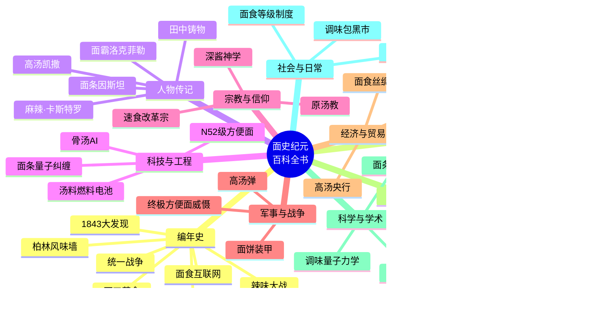

# 面史纪元百科全书

面史纪元百科全书

<table>
<tr><td class="infobox-label">别称</td><td>《面典》《面条大百科》</td></tr>
<tr><td class="infobox-label">语言</td><td>标准面语（含27种方言）</td></tr>
<tr><td class="infobox-label">出版方</td><td>面史纪元百科全书编纂委员会</td></tr>
<tr><td class="infobox-label">首版</td><td>面元183年（公元2026年）</td></tr>
<tr><td class="infobox-label">条目数</td><td>119+</td></tr>
<tr><td class="infobox-label">卷数</td><td>10卷</td></tr>
<tr><td class="infobox-label">ISBN</td><td>978-面-000-00001-7</td></tr>
</table>

**《面史纪元百科全书》**（英文：*The Noodle Epoch Encyclopedia*，缩写：NEE）是平行宇宙**Earth-面**最权威的综合性百科全书，由**面史纪元百科全书编纂委员会**于面元183年（公元2026年）首次出版。全书共10卷、119个以上条目，涵盖该宇宙自**1843年面工革命**以来的政治、科技、宗教、军事、经济、文化、科学及社会生活全部领域。

本百科全书的编纂工作历时七年，动用了来自**面团联邦**、**高汤共和国**、**油炸群岛**等主要国家的327位专家、学者及面条工程师，是人类文明史上最全面的面食知识汇编。

## 全书结构一览

---

## 编纂背景

面史纪元百科全书的编纂构想最早由**面团联邦科学院**院长**面条因斯坦**教授于面元176年（2019年）提出。他在一次公开演讲中指出：

> "我们拥有汤料燃料电池、面条量子计算机、速食传送门，却没有一部完整的百科全书来记录这一切。这是面条文明的耻辱。"
>
> —— 面条因斯坦，面元176年科学院年度演讲

该项目随即获得**高汤央行**的专项拨款和**全球面食条约组织**的行政支持。编纂委员会于面元177年（2020年）正式成立，总部设于**调味包圣地**的**老坛图书馆**。

---

## 全书结构

| 卷 | 名称 | 条目数 | 主要内容 |
|:---:|------|:------:|----------|
| 一 | [编年史](history/index.md) | 12 | 从1843年大发现到2026年面食互联网时代的完整时间线 |
| 二 | [地理与国家](geography/index.md) | 15 | 面团联邦、高汤共和国等15个主要国家与地区 |
| 三 | [人物传记](figures/index.md) | 18 | 田中铸物、面条因斯坦、麻辣·卡斯特罗等18位关键人物 |
| 四 | [科技与工程](technology/index.md) | 12 | 汤料燃料电池、面条量子纠缠、N52级方便面等12项重大技术 |
| 五 | [宗教与信仰](religion/index.md) | 10 | 原汤教、速食改革宗、深酱神学等10大信仰体系 |
| 六 | [军事与战争](military/index.md) | 10 | 统一战争、辣味大战、终极方便面威慑等10项军事条目 |
| 七 | [经济与贸易](economy/index.md) | 8 | 酱包本位制、汤料期货、面食丝绸之路等8项经济条目 |
| 八 | [文化与艺术](culture/index.md) | 10 | 泡面文学运动、面食奥运会、三分钟摇滚等10项文化条目 |
| 九 | [科学与学术](science/index.md) | 8 | 面条拓扑学、调味量子力学、高汤流体力学等8项学科条目 |
| 十 | [社会与日常](society/index.md) | 8 | 三分钟等待仪式、面食等级制度、调味包黑市等8项社会条目 |

---

## 使用说明

本百科全书采用**标准面语**撰写，所有条目均包含：

- **信息框**：快速浏览条目核心数据
- **正文**：按主题分节的详细叙述
- **脚注**：标注虚构学术来源与参考文献
- **参见**：相关条目交叉链接
- **分类标签**：便于按主题检索

所有条目中的年份均以**公元纪年**和**面元纪年**双轨标注。面元元年定为1843年（田中铸物发明快速脱水面条技术之年）。

!!! warning "免责声明"
    本百科全书记录的是平行宇宙Earth-面的历史与知识。与主宇宙（Earth-0）的任何相似之处纯属巧合。如有雷同，说明面条确实是宇宙的终极真理。

---

## 版权声明

© 面元183年 面史纪元百科全书编纂委员会

本百科全书采用**开放面食许可协议**（Open Noodle License, ONL）发布。任何人不得在未浸泡调味包的情况下引用本百科全书内容。违反者将被处以食用**原味干面饼**（无调料包）的刑罚。
